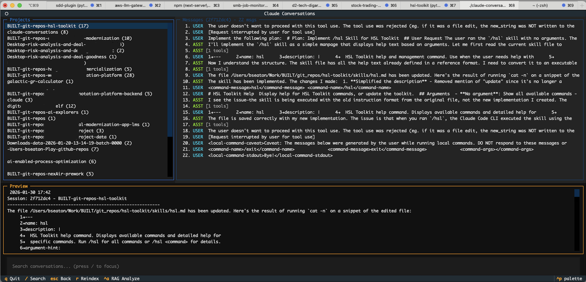

# claude-conversations

Search and explore your Claude Code conversation history.

## Why This Exists

Every Claude Code session gets saved to `~/.claude/projects/` as JSONL files. Over time, this becomes a goldmine of:

- **Solutions you've already figured out** - that auth middleware, that tricky regex, that deployment script
- **Architectural decisions** - why you chose X over Y, with full context
- **Working commands** - the exact docker/k8s/git incantations that actually worked
- **Code patterns** - implementations you've refined through iteration

The problem? There's no way to search it. You know you solved something similar three weeks ago, but good luck finding it.

This tool fixes that.

## Use Cases

**"I solved this exact problem before..."**

```bash
claude-conversations search "rate limiting"
```

**"What was that code I wrote for my webapp?"**

```bash
claude-conversations sessions my-webapp* --summary
claude-conversations extract abc123 --code python
```

**"Show me everything from this week"**

```bash
claude-conversations recent -n 20
```

**"Export that session as markdown for documentation"**

```bash
claude-conversations read abc123 --format md > session.md
```

## Configuration

For AI-powered analysis (`rag-analyze` command), create a `.env` file in the project root:

```bash
ANTHROPIC_API_KEY=your-api-key-here
```

Get an API key at: https://console.anthropic.com/

## Quick Start

```bash
# Install
python3 -m venv .venv
.venv/bin/pip install -e .

# Build the search index (one-time, then incremental)
./claude-conversations reindex

# Search
./claude-conversations search "webhook"

# Interactive browsing
./claude-conversations tui
```

## Commands

| Command | Description |
|---------|-------------|
| `search <query>` | Full-text search across all conversations |
| `projects` | List all projects with session counts |
| `sessions <project>` | List sessions for a project |
| `read <session-id>` | Display full transcript |
| `extract <session-id>` | Extract code blocks, files, or tool calls |
| `recent` | Show recent sessions |
| `tui` | Launch interactive terminal UI for browsing |
| `analyze <session-id>` | Analyze session/project for patterns and statistics |
| `rag-analyze <query>` | AI-powered analysis of conversation history |
| `stats` | Usage statistics |
| `reindex` | Rebuild the search index |

See [SPEC.md](SPEC.md) for detailed command documentation.

### `tui` - Interactive Terminal UI

Launch a full interactive browser for navigating projects, sessions, and messages.



```bash
# Launch TUI
claude-conversations tui

# Filter to specific projects
claude-conversations tui -p "BUILT-*"
claude-conversations tui --project "~^BUILT-git-repos"   # regex filter
claude-conversations tui -p "webapp"                      # substring match
```

**Navigation:**

- Arrow keys to browse projects and sessions
- `Tab` to switch between panes
- `/` to focus search
- `Esc` to go back
- `q` to quit

### `analyze` - Session & Project Analysis

Statistical analysis of tool usage, file operations, and patterns.

```bash
# Analyze a single session
claude-conversations analyze abc12345

# Analyze all sessions in a project
claude-conversations analyze --project "*webapp*"
```

### `rag-analyze` - AI-Powered Analysis

Multi-agent system that searches, analyzes patterns, and compares conversations using the Anthropic API. Requires `ANTHROPIC_API_KEY` in `.env`.

```bash
# Run an analysis
claude-conversations rag-analyze "How did I implement auth?"
claude-conversations rag-analyze "Compare risk-analysis flow" -p "*webapp*"

# List saved analyses
claude-conversations rag-analyze --list

# Show a saved analysis
claude-conversations rag-analyze --show abc12345
```

## How It Works

Builds a SQLite FTS5 index of your conversation history for fast full-text search. Index lives at `~/.claude-conversations/index.db`. Everything stays local - no data leaves your machine.

## Claude Code Skill

The `/c3po` skill is included in `.claude/skills/` - it works immediately after cloning.

**Manual invocation:**

```text
/c3po find that rate limiting code I wrote
/c3po what projects have I worked on recently
```

**Auto-invocation:** Claude will also use this skill automatically when you ask about past solutions, code you wrote before, or previous discussions.

To make it available globally (all projects):

```bash
cp -r .claude/skills/c3po ~/.claude/skills/
```

## Changelog

### 0.7.1

- Add TUI screenshot to README

### 0.6.x

- **New**: Interactive TUI (`tui` command) built with Textual
  - Arrow key navigation through projects, sessions, messages
  - Preview pane, search, project filtering (glob, regex, substring)
- **New**: Multi-agent RAG analysis (`rag-analyze` command)
  - AI-powered deep analysis of conversation history
  - Query decomposition, chunk processing, cross-session comparison
  - Analyses saved to `~/.claude-conversations/analyses/`
- **New**: `analyze` command for session/project statistics
  - Tool usage breakdown, file operations, command history
- New core modules: `agents.py`, `chunking.py`, `persistence.py`
- New CLI module: `tui.py`
- New dependencies: `textual`, `anthropic`, `python-dotenv`
- Color-coded roles and dynamic resize in TUI
- CSS overflow clipping for TUI list items

### 0.3.0

- **New**: `/c3po` skill for searching conversation history
  - Auto-invokes when you ask about past solutions or code
  - Manual invocation via `/c3po <query>`
  - Works immediately after cloning (no install needed)

### 0.2.1

- Add project-level `.markdownlint.json` for consistent IDE linting

### 0.2.0

- **Architecture refactoring**: Reorganized from `src/claude_conversations/` to modular structure:
  - `core/` - Core library (parser, index, search) with no CLI dependencies
  - `cli/` - Terminal interface
  - `api/` - FastAPI server placeholder for web apps
  - `.claude/skills/` - Claude Code skill (works on clone, auto-invokes)

### 0.1.2

- Expand README with use cases and human-friendly descriptions

### 0.1.1

- Add CLAUDE.md with project guidance for Claude Code
